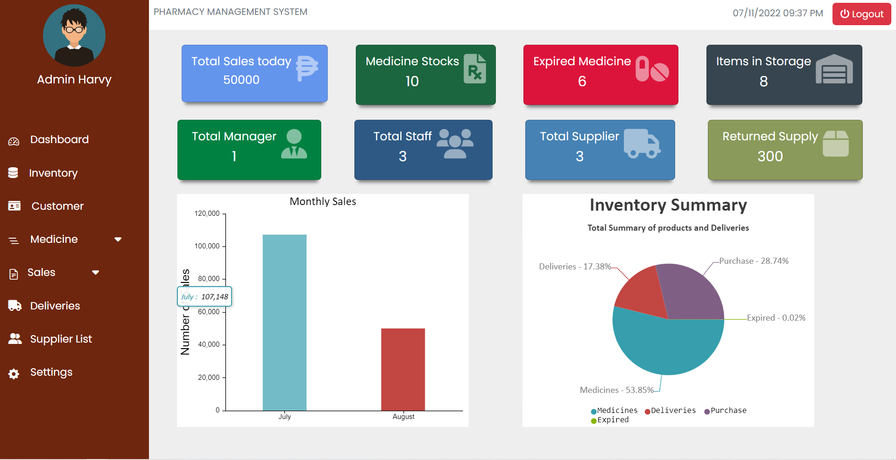
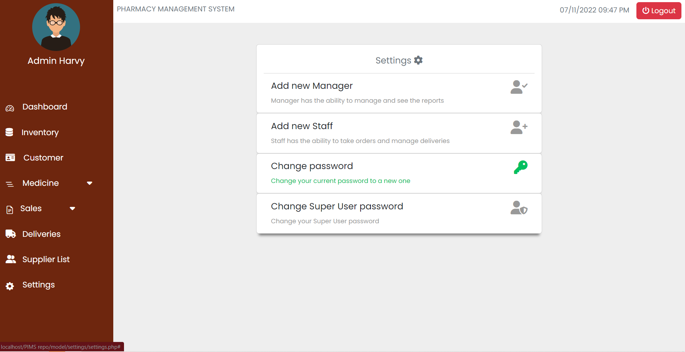

# Pharmacy Management System
- A complete Pharmacy management system that handles inventory,sales,customer information,
deliveries and security

## Manager login
  - Dashboard
    - Summary of all the data upon the system even the list of expired medicine
    
  - Medicine list
    - List of all inputed medicine within the stocks
    - sort medicine based on types and shelves location
    
  - Medicine Type
    - List the all the types you can choose within the stocks
      
  - Medicine Category
    - List the all the types you can choose within the stocks
  - Daily sales report and Sales Summary
    - Reports of sales and summary of sales based on inputted Start and end Date
     
  - Change password and Create new Manager Acc.
    - Change the password of the login user and Create another acc for new Manager
     

### Staff login
  - Sales(Add customer)
    - Input the Details of customer and their purchase
     
  - Customer List
    - List of all customer within the day and their purchase
    
    
    -The system is not responsive and can only be use on pc hardware
      -Demo:http://pharmacyinventoryandinformationsystem.rf.gd/?i=1

## LICENSE
[GNU Lesser General Public License v3.0](LICENSE)